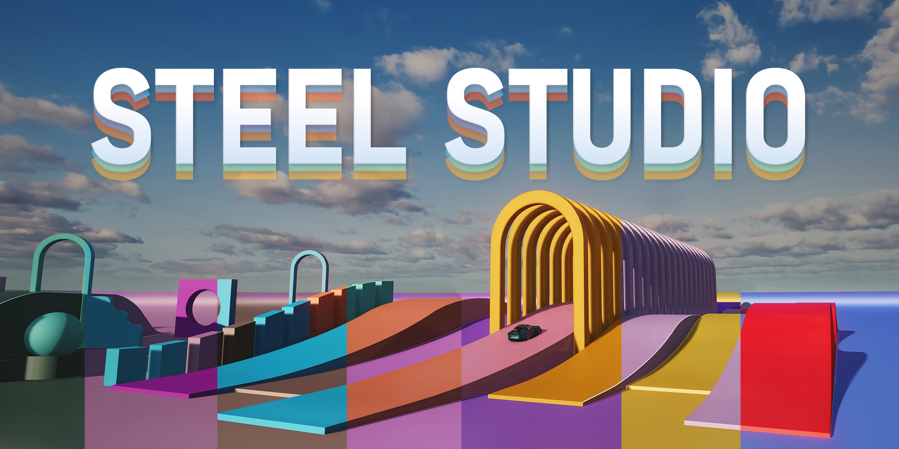

# Steel Studio - Assetto Corsa LUA App

Steel Studio takes your customization experience to the next level, offering intuitive tools and features that give you complete control over your showroom environment. Whether you want to tweak the lighting, modify the backdrop, or highlight specific elements, Steel Studio provides the flexibility and precision needed to bring your vision to life.

This LUA App Requires CSP - Custom Shaders Patch.\
Read more of the requirements and the [documentation here](https://steel89ita.github.io/steel-docs-ac/docs/intro).

### Installation

Download the latest **Steel Studio** from [Github - Release](https://github.com/steel89ita/ac_steel_studio/releases) and place the SteelStudio folder in your Assetto Corsa lua apps directory like here:
```
...\steamapps\common\assettocorsa\apps\lua\SteelStudio
```

### Open the App

Start your game and from the Apps bar search for the ```Steel Studio``` app.


### License

This project is licensed under the GNU GPL v3 License and readable in the LICENSE.txt file.
The GNU GPLv3 lets people do almost anything they want with your project, except distributing closed source versions.
Sharing improvements and help with the project is always appreciated ❤️